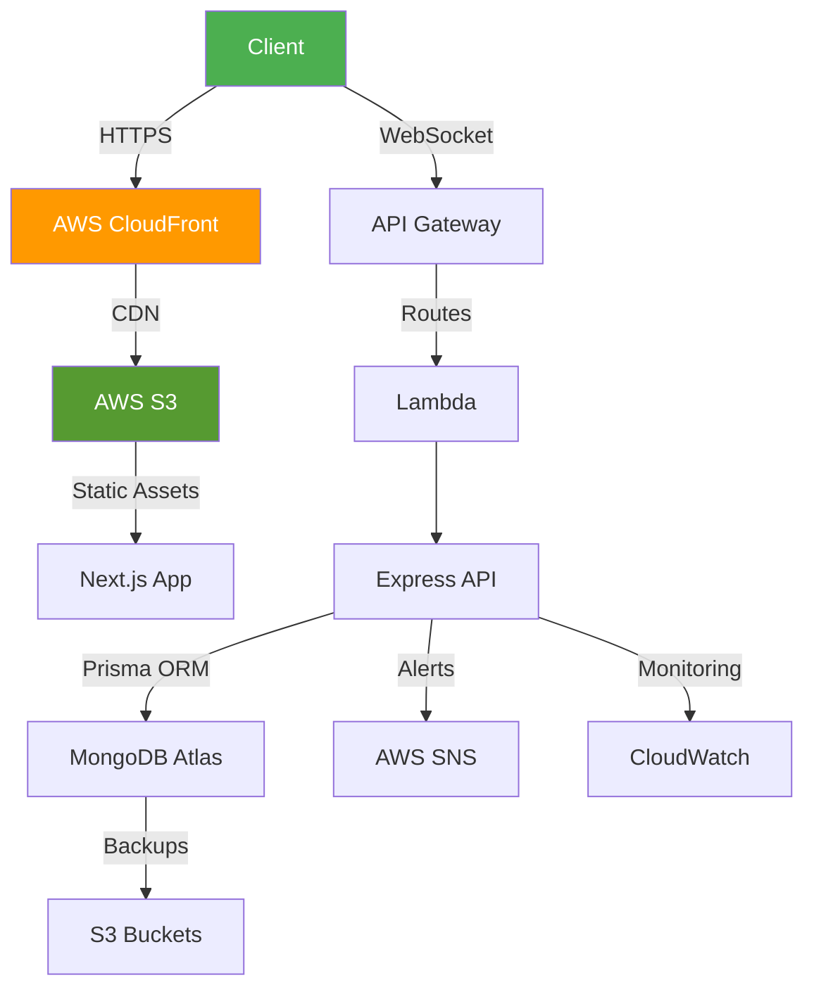

Here's the complete, polished markdown documentation:

```markdown
# 🚀 PingIt - Next-Gen Website Uptime Monitoring

[](https://opensource.org/licenses/MIT)
[](https://mern.io/)
[](https://aws.amazon.com)


## 🌟 Introduction
**PingIt** revolutionizes website monitoring with real-time status tracking and enterprise-grade reliability. Our platform empowers businesses through:

- Instant downtime detection ⚡  
- Smart multi-channel alerts 📨  
- Historical performance analytics 📊  
- Auto-scaling AWS infrastructure 🌐

## 🎯 Key Features

### 🛡 Core Features
| Feature                | Technology Stack       | Status |
|------------------------|------------------------|--------|
| Real-time Monitoring   | WebSocket + Node.js    | ✅ Live |
| Live Dashboard         | React + Chart.js       | ✅ Live |
| Multi-channel Alerts   | AWS SNS + Twilio       | ✅ Live |
| Data Management        | MongoDB + Prisma       | ✅ Live |
| Authentication         | Auth0 + JWT            | ✅ Live |

### 🚧 Roadmap
| Feature                 | Status          | ETA     |
|-------------------------|-----------------|---------|
| Web3 Validator Network  | 🔄 Development  | Q4 2025 |
| AI Anomaly Detection    | 🛠 Planning     | Q1 2026 |
| Team Collaboration      | 💡 Proposed     | Q2 2026 |

## 🛠 Tech Stack

### **MERN Architecture**


### **AWS Infrastructure**


## 📊 System Architecture



## 🚀 Getting Started

### Prerequisites
- Node.js 18+
- MongoDB Atlas Cluster
- AWS Account

### Installation
```bash
# Clone repository
git clone https://github.com/yourusername/pingit.git

# Install dependencies
cd pingit && npm install

# Configure environment
cp .env.example .env

# Start development
npm run dev


## 👥 Contributing
1. Fork the repository
2. Create feature branch (`git checkout -b feature/amazing-feature`)
3. Commit changes (`git commit -m 'Add amazing feature'`)
4. Push branch (`git push origin feature/amazing-feature`)
5. Open Pull Request

## 📜 License
Distributed under MIT License. See `LICENSE` for details.

## 👨💻 Author
**Satyam Jha**  
[](https://www.linkedin.com/in/satyammjh/)
[](https://github.com/satyamjha)

---

[⬆ Back to Top](#-pingit---next-gen-website-uptime-monitoring)
```
